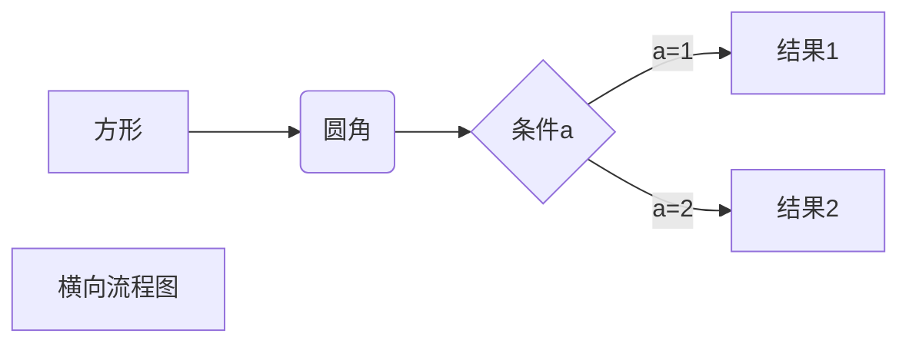

# Markdown的学习笔记
## 标题的使用

```markdown
# 这是一级标题
## 这是二级标题
### 这是三级标题
#### 这是四级标题
##### 这是五级标题
###### 这是六级标题 
标题只有6级
```
## 段落与字体格式
### 段落
```markdown
段落并没有特殊的格式，可直接再新的一行直接编写，换行则有两种方式
1.在文本末尾加两个空格再加一个回车，两个段落之间不会有空行。
2.在文本末尾加两个回车，这会使两个段落之间会有一个空行。
如：  
这是第一段  
这是第二段


如：  
这是第一段

这是第二段
效果如下
```
如：  
这是第一段  
这是第二段


如：  
这是第一段

这是第二段
### 字体
```markdown
*斜体文本*
_斜体文本_
**粗体文本**
__粗体文本__
***斜粗体文本***
___斜粗体文本___
**_斜粗体文本_**
__*斜粗体文本*__
效果如下：
```
*斜体文本*  
_斜体文本_  
**粗体文本**  
__粗体文本__  
***斜粗体文本***  
___斜粗体文本___  
**_斜粗体文本_**  
__*斜粗体文本*__  
### 分割线
```markdown
***
* * *
*****
- - -
--------- 
效果如下
```
这是第一条分割线
***
这是第二条分割线
* * *
这是第三条分割线
*****
这是第四条分割线
- - -
这是第五条分割线

---------
### 删除线
```markdown
~~删除线~~
效果如下
```
~~删除线~~
### 下划线
```markdown
通过HTML的<u>标签实现
<u>下划线</u>
效果如下
```
<u>下划线</u>

### 脚注
脚注是指鼠标指过去有一段悬浮的提示文字，被注明的文本会像荧光笔一样被标注。
```markdown
这是一段文本[^这是要注明的文本]
[^这是要注明的文本]: 这是注明的内容。
效果如下
```
这是一段文本[^这是要注明的文本]
[^这是要注明的文本]: 这是注明的内容。
## 列表
### 无序列表
```markdown
* 第一项
* 第二项
* 第三项

+ 第一项
+ 第二项
+ 第三项


- 第一项
- 第二项
- 第三项
效果如下
```
* 第一项
* 第二项
* 第三项

+ 第一项
+ 第二项
+ 第三项


- 第一项
- 第二项
- 第三项
### 有序列表
有序列表使用数字并加上 . 号来表示
 ```markdown
1. 第一项
2. 第二项
3. 第三项
效果如下
 ```
1. 第一项
2. 第二项
3. 第三项
### 嵌套列表
列表嵌套只需在子列表中的选项前面添加两个或四个空格即可
```markdown
无序列表嵌套无序列表
- 第一项
    - 第一项嵌套的第一个元素
    - 第一项嵌套的第二个元素
- 第二项：
    - 第二项嵌套的第一个元素
    - 第二项嵌套的第二个元素
无序列表嵌套有序列表
- 第一项
    1. 第一项嵌套的第一个元素
    2. 第一项嵌套的第二个元素
- 第二项：
    1. 第二项嵌套的第一个元素
    2. 第二项嵌套的第二个元素
有序列表嵌套有序列表
1. 第一项
    1. 第一项嵌套的第一个元素
    2. 第一项嵌套的第二个元素
2. 第二项：
    1. 第二项嵌套的第一个元素
    2. 第二项嵌套的第二个元素
有序列表嵌套无序列表
1. 第一项：
    - 第一项嵌套的第一个元素
    - 第一项嵌套的第二个元素
2. 第二项：
    - 第二项嵌套的第一个元素
    - 第二项嵌套的第二个元素
效果如下
```
无序列表嵌套无序列表
- 第一项
    - 第一项嵌套的第一个元素
    - 第一项嵌套的第二个元素
- 第二项：
    - 第二项嵌套的第一个元素
    - 第二项嵌套的第二个元素

无序列表嵌套有序列表
- 第一项
    1. 第一项嵌套的第一个元素
    2. 第一项嵌套的第二个元素
- 第二项：
    1. 第二项嵌套的第一个元素
    2. 第二项嵌套的第二个元素

有序列表嵌套有序列表
1. 第一项
    1. 第一项嵌套的第一个元素
    2. 第一项嵌套的第二个元素
2. 第二项：
    1. 第二项嵌套的第一个元素
    2. 第二项嵌套的第二个元素

有序列表嵌套无序列表
1. 第一项：
    - 第一项嵌套的第一个元素
    - 第一项嵌套的第二个元素
2. 第二项：
    - 第二项嵌套的第一个元素
    - 第二项嵌套的第二个元素

## 区块
区块引用是在段落开头使用 > 符号 ，然后后面紧跟一个空格
```markdown
正常区块
> 区块1  

> 区块2

> 区块3

区块嵌套
> 区块1
>> 区块2
>>> 区块3

效果如下
```
正常区块
> 区块1  

> 区块2

> 区块3

区块嵌套
> 区块1
>> 区块2
>>> 区块3

## 代码及代码块
### 代码标注
如果是段落上的一个函数或片段的代码可以用反引号把它包起来（`）
```markdown
`printf()` 函数

效果如下
```
`printf()` 函数

### 代码区块
代码区块使用 4 个空格或者一个制表符（Tab 键）
```markdown
    class Main(){
        pass:
    }

效果如下
```
    class Main(){
        pass:
    }
用 ``` 包裹一段代码，并指定一种语言（也可以不指定）
```markdown
    ```javascript
    $(document).ready(function () {
        alert('RUNOOB');
    });
```
```
效果如下

```javascript
$(document).ready(function () {
    alert('RUNOOB');
});
```

## 链接
```markdown
[链接名称](链接地址)

或者

<链接地址>
效果如下

```
[百度](www.baidu.com)

或者

<https://www.baidu.com>

## 图片
图片语法格式
```markdown


Markdown 还没有办法指定图片的高度与宽度，如果你需要的话，你可以使用普通的  标签


效果如下
```


## 表格
制作表格使用 | 来分隔不同的单元格，使用 - 来分隔表头和其他行
```markdowm
|表头1|表头2|
|----|----|
|单元格1|单元格2|
|单元格3|单元格4|


效果如下
```

|表头1|表头2|
|----|----|
|单元格1|单元格2|
|单元格3|单元格4|

表格的对齐方式：

- -: 设置内容和标题栏居右对齐。
- :- 设置内容和标题栏居左对齐。
- :-: 设置内容和标题栏居中对齐。
```markdown
| 左对齐 | 右对齐 | 居中对齐 |
| :-----| ----: | :----: |
| 单元格 | 单元格 | 单元格 |
| 单元格 | 单元格 | 单元格 |

效果如下
```

| 左对齐 | 右对齐 | 居中对齐 |
| :-----| ----: | :----: |
| 单元格 | 单元格 | 单元格 |
| 单元格 | 单元格 | 单元格 |


## MarkDown高级
### HTML 元素
目前支持的 HTML 元素有：\<kbd> \<b> \<i> \<em> \<sup> \<sub> \<br>等

如：\<kdd>的使用方法：
```html
使用 <kbd>Ctrl</kbd>+<kbd>Alt</kbd>+<kbd>Del</kbd> 重启电脑
```
使用 <kbd>Ctrl</kbd>+<kbd>Alt</kbd>+<kbd>Del</kbd> 重启电脑

### 转义

很多特殊符号来表示特定的意义，如果需要显示特定的符号则需要使用转义字符，Markdown 使用反斜杠转义特殊字符【看见不能显示的字符需要显示加个反斜杠就行】

### 公式

使用编辑器就行

### typora 画流程图、时序图(顺序图)、甘特图【mermaid】

